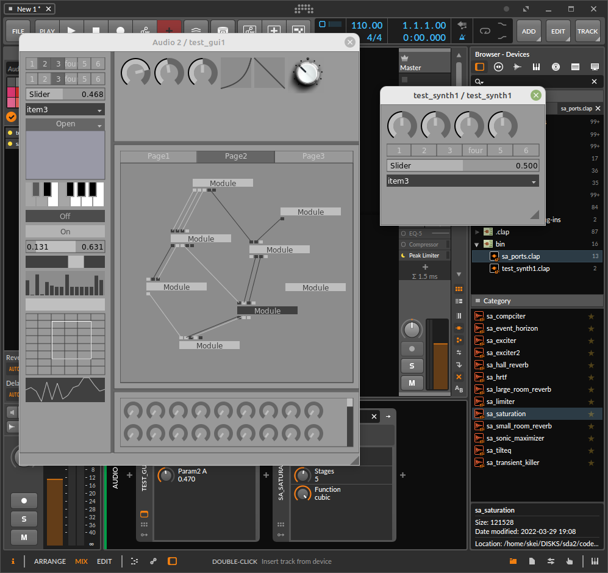

# MIP 2
"multum in parvo"  
(much in little)

#### plugins, wrappers, abstractions, simplifications, helpers, ..

v0.0.0  
not production-ready, in progress, prototype, proof of concept, pre-, changes are frequent, code will break..

NOTE: yet another structural/lowlevel update in progress.. be patient.. things will calm down again soon.. this will (hopefully) be the last major change before we can start behaving a bit more 'normal' and stable, with proper versioning and commits and stuff..

---

- os: linux (windows might come later)
- plugin: clap (with wrappers for exe, vst2, vst3)
- host: clap, ladspa (coming: vst2/vst3)
- gui: xcb, cairo, opengl, nanovg (all optional)
- io: jack audio/midi (standalone executable)
- other: too much to list..

---

pro/con:

- headers-only
- lock-free
- un-modern, un-cool c++
- minimal setup
- minimal dependencies
- permissive license
- (semi-) modular

---

priorities:

- make it work
- make it right
- make it fast, small, stable, bugfree, pretty, etc..

---

