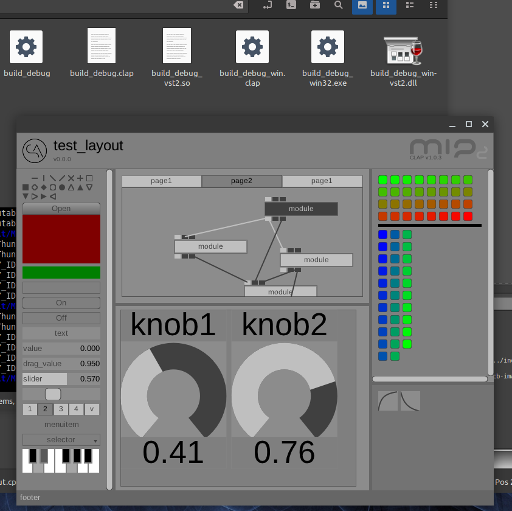
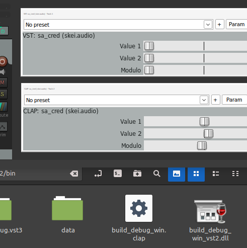

deprecation-warning! reboot in progress.. restructure, refactor, rename, restart.. this (mip2) was/is the prototype, MIP is 'the real deal'.. https://github.com/skei/MIP

-----

# MIP 2
"multum in parvo"  
(latin, much in little)

#### plugins, wrappers, abstractions, simplifications, helpers, ..

v0.0.0  
not production-ready, in progress, prototype, proof of concept, pre-, changes are frequent, code will break..

things will hopefully calm down soon.. then we can start behaving a bit more 'normal' and stable, with proper versioning and commits and stuff..

---

- os: linux, windows (in progress)
- plugin: clap (with wrappers for exe, vst2, vst3)
- host: clap, ladspa (coming: vst2/vst3)
- gui: xcb, cairo, opengl, nanovg, win32, gdi, wgl, nogui
- io: jack audio/midi (standalone executable)
- other: too much to list..

---

pro/con:

- headers-only
- un-modern, un-cool c++
- preprocessor abuse
- minimal setup
- minimal dependencies
- permissive license
- (semi-) modular

---

priorities:

- make it work
- make it right
- make it fast, small, stable, bugfree, pretty, etc..

---

